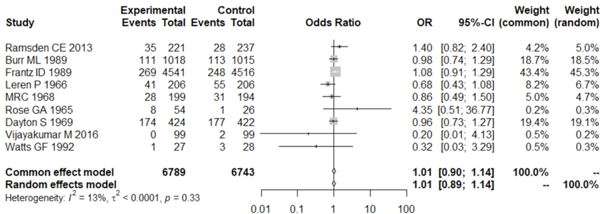

## Saturated Fat

Is saturated fat bad for you? 

::: {.fragment}

Does reducing dietary saturated fat reduce the occurrence of **heart attacks, death by heart attack, or death by any cause**? 

:::

::: {.fragment}

What do the latest meta-analyses on RCTs say?

:::
::: {.incremental}

- April 2025 meta-analysis said "no". 

- December 2025 meta-analysis said "yes...sort of".

:::

::: {.fragment}

So which is it?

:::

---

## Meta-analysis

::: {.incremental}

- A method of combining evidence from similar studies 

- using quantitative methods (statistical techniques)

- More precise conclusion (higher statistical power than a single study)

- Studies should be relatively similar in design and outcome

- The top of the [evidence hierarchy](https://guides.library.ucdavis.edu/systematic-reviews/levels-of-evidence)

:::

---

### The Forest Plot

::: {.caption_gray}

*from Yamada et al. (2025), Figure 3. Forest plots of saturated fatty acid reduction trials on all-cause mortality.*

:::

{width=90% fig-align="center"}

::: {.smaller_table}
::: {.fragment}

*Heterogeneity* (I²): Statistical heterogeneity = the portion of between-study variation in observed effect estimates that **cannot** be explained by within-study sampling error alone. Higher = more study variation

::: {.smaller3}

- I² asks how much the study results differ from each other beyond what would be expected from random sampling error alone.
  1. Calculate how far each study's estimate is from the pooled estimate
  2. Weight those differences by each study’s precision, then add them up.
  3. Check whether the studies disagree more than would be expected from ordinary random sampling error, given each study’s own margin of error, assuming they were all estimating the same true effect.
  4. I² expresses the excess disagreement as a percentage of the total observed disagreement.
 
:::
:::
::: {.fragment}

It is not Clinical/methodological heterogeneity (differences/variation in study population, interventions, outcomes definitions...etc). 

:::

:::

---

#### MAIN EVENT: YAMADA vs. STEEN 2025

::: {.smaller_table}

::: {.fragment}

**Yamada et al. (2025)**

:::
::: {.incremental}

- Included 9 RCTs
- Found no significant reduction in:
  - all-cause mortality, cardiovascular mortality, myocardial infarction, coronary artery events
- Stroke could not be meaningfully evaluated because too few stroke events were reported.
- Most included trials were secondary prevention studies, and very few participants were on statins.

:::
:::
::: {.caption_gray}
::: {.fragment}

"The findings indicate that a reduction in saturated fats cannot be recommended at present to prevent cardiovascular diseases and mortality."

:::
:::
::: {.smaller_table}

::: {.fragment}

**Steen et al. (2025)**

:::

::: {.incremental}

- Included 17 RCTs total (fewer per outcome/intervention)
- Overall, reducing or modifying saturated fat intake trended toward lower all-cause mortality, cardiovascular mortality, nonfatal MI, and stroke
  - but for all four outcomes, the pooled confidence intervals included **no effect**.
- In 5 year period, estimated absolute effect varied by baseline cardiovascular risk. With 'predefined thresholds':
  - In low cardiovascular risk groups, the **point estimate** suggests an "unimportant effect". 
  - In high cardiovascular risk groups, the **point estimate** suggests an "important effect".
  
:::
:::
::: {.caption_gray}
::: {.fragment}

"Among persons at high cardiovascular risk, low- to moderate certainty evidence was found for important reductions in mortality and major cardiovascular events, particularly for MI, with respect to replacing saturated fat with polyunsaturated fat.

:::
:::

---

### Meta-analyses on RCTs: SFA Reduction

::: {.smaller_large_table}

 

| Year | Review | Core frame | Result | Benefit? |
|-|--|---|----|-|
| 2010 | **Mozaffarian et al.** | PUFA replacing SFA; RCT meta-analysis. | Lower CHD events when PUFA replaced SFA. | **Yes** |
| 2011 | **Hooper et al.** | Reduced/modified fat; not SFA-only. | Lower CVD events; no clear all-cause or CVD mortality benefit. | **Yes** |
| 2013 | **Ramsden et al.** | Sydney Diet Heart reanalysis + linoleic acid trial meta-analysis. | No overall CVD benefit; Sydney showed **higher** all-cause, CVD, and CHD mortality. | **No** |
| 2014 | **Schwingshackl & Hoffmann** | Secondary prevention; reduced/modified fat. | No significant benefit for mortality, CVD events, or MI. | **No** |
| 2015 | **Hooper et al.** | SFA-specific Cochrane review. | Lower combined CVD events; no clear mortality benefit. | **Yes** |
| 2017 | **Sacks et al.** | AHA review of SFA replacement trials. | Lower CVD incidence when SFA replaced with unsaturated fat, esp. PUFA. | **Yes** |
| 2020 | **Hooper et al.** | Updated SFA-specific Cochrane review. | Lower combined CVD events; little or no mortality benefit. | **Yes** |
| 2025 | **Yamada et al.** | SFA-restriction RCT meta-analysis. | No significant effect on CVD and all-cause mortality,MI, or coronary events. | **No** |
| 2025 | **Steen et al.** | Risk-stratified review of reduced/modified SFA RCTs. | Little / no benefit in low-risk groups; possible benefit high-risk, especially with PUFA replacement. | **Yes** |

:::

---

## Lack of Consistency

Why?

::: {.smaller}

::: {.incremental}

- which trials to include
- which *version* of trials to include
- at what level of detail / subgroup
  - length of trial, age of participants, risk profile, primary / secondary prevention, dietary replacement 
- specific outcomes
  - heart attack, heart attack death, stroke, any coronary event, all-cause death

:::
:::

---

## RCTs SFA Reduction / CVD

::: {.sfa_table}

| Pub year | Start year | Trial | N | Duration | Population | Comparator | SFA change | Hard outcomes | Trans-fat issue | Major caveat |
|-|-:|---|-:|--|---|---|--|--|--|---|
| 1965 | NR | [**Rose / St Mary’s**](https://pubmed.ncbi.nlm.nih.gov/14288105/) | 80 | 1.5–1.7 y avg, 2yr study | Men with angina or post-MI | Corn oil or olive oil + fat restriction vs usual diet | NR | Limited | Unclear* | Tiny 3-arm trial; SFA not measured |
| 1966 | 1956 | [**Oslo Diet-Heart**](https://pubmed.ncbi.nlm.nih.gov/5228820/) | 412 | 5 y | Men with prior MI | Low-SFA advice + soy oil/fish vs usual diet | NR | Yes | Unclear* | SFA not directly measured; fish/cod-liver cointervention |
| 1968 | 1960 | [**MRC Soybean Oil**](https://pubmed.ncbi.nlm.nih.gov/4175085/) | 393 | 3.8 y mean | Men after first MI | Soybean oil + fat restriction vs usual diet | NR | Limited | Unclear* | Soy-oil supplement trial; SFA not measured |
| 1969 | 1959 | [**LA Veterans Administration**](https://www.ahajournals.org/doi/10.1161/01.CIR.40.1S2.II-1) | 846 | ? | Semi-institutionalized men, mixed CHD status | Whole diet replacing about two-thirds of SFA with unsaturated fat | -10.2% | Yes | Probable | Partial feeding / institutional setting |
| 1978 | 1973 | [**Oxford Retinopathy**](https://pubmed.ncbi.nlm.nih.gov/629924/) | 249 | 9.3 y mean | Newly diagnosed type 2 diabetes | Lower-fat / higher-PUFA diabetic diet vs average diabetic diet | -9.7% | No | Unclear* | Retinopathy trial; deaths not cleanly by arm |
| 1978 | 1966 | [**Sydney Diet Heart Study**](https://pubmed.ncbi.nlm.nih.gov/727035/) | 458 | 4.3 y mean | Men with prior MI | Safflower oil + safflower margarine vs usual diet | -3.7% | Yes | Probable | LA-specific substitution trial; margarine-era intervention |
| 1979 | 1959 | [**Finnish Mental Hospital (Men)**](https://pubmed.ncbi.nlm.nih.gov/5652949/) | ~461 | 6 y per arm | Institutionalized middle-aged men without CHD | Hospital SCL diet vs normal hospital diet | NR | Limited | Probable | Non-randomized cluster crossover; open enrollment |
| 1979 | 1973 | [**Houtsmuller**](https://pubmed.ncbi.nlm.nih.gov/7342100/) | 102 | Up to 6 y | Newly diagnosed diabetes | High-linoleic modified-fat diet vs usual diabetic diet | NR | Limited | Unclear* | Retinopathy/diabetes focus; SFA not reported |
| 1983 | 1959 | [**Finnish Mental Hospital (Women)**](https://pubmed.ncbi.nlm.nih.gov/6840954/) | ~357 | 6 y per arm | Institutionalized middle-aged women without CHD | Hospital SCL diet vs normal hospital diet | NR | Limited | Probable | Non-randomized cluster crossover; open enrollment |
| 1989 | 1983 | [**DART**](https://pubmed.ncbi.nlm.nih.gov/2571009/) | 2033 | 2 y | Men recovering from MI | Lower-fat / higher-P:S advice vs usual advice | -4.0% | Yes | Unclear* | Factorial trial; only 2 years |
| 1989 | 1968 | [**Minnesota Coronary Survey**](https://pubmed.ncbi.nlm.nih.gov/2643423/) | 9057 | Avg 1 y, max 4.5 y | Institutionalized men and women without CHD | Corn oil + corn-oil margarine vs control diet | -9.1% | Yes | Probable | Open enrollment; average exposure short |
| 1992 | NR | [**STARS**](https://pubmed.ncbi.nlm.nih.gov/1347091/) | ~60 | 3 y | Men with established CHD | Low-SFA diet vs usual care | -7.0% | Sparse | Unclear | Tiny trial; angiography-focused |
| 1994 | NR | [**Black**](https://pubmed.ncbi.nlm.nih.gov/8145782/) | 133 | 2 y | People with non-melanoma skin cancer | Low-fat diet vs usual diet | -6.2% | Sparse | Low | Not a CVD trial |
| 1997 | 1987 | [**Simon**](https://pubmed.ncbi.nlm.nih.gov/9121940/) | 194 | 2 y | Women at high breast-cancer risk | Low-fat diet vs usual diet | -6.1% | No | Low | Feasibility / cancer trial; deaths not clearly by arm |
| 2001 | 1991 | [**Moy**](https://pubmed.ncbi.nlm.nih.gov/11832672/) | 267 | 2 y | Siblings of early-CHD patients with risk factors | Low-fat counseling vs usual care | -2.9% | Sparse | Low | No deaths; family-risk trial |
| 2004 | 1988 | [**Ley**](https://pubmed.ncbi.nlm.nih.gov/14739050/) | 176 | 4.1 y mean | Impaired glucose tolerance / high-normal glucose | Reduced-fat program vs usual diet | -3.4% | Sparse | Low | Prediabetes trial; not CVD-primary |
| 2006 | 1993 | [**WHI Dietary Modification**](https://pubmed.ncbi.nlm.nih.gov/16467234/) | 48,835 | 8.1 y mean | Postmenopausal women, with and without baseline CVD | Low-fat pattern with fruit/veg emphasis vs usual diet | -2.9% | Yes | Low | Mostly low-fat / carb-replacement trial, not a clean SFA test |
| 2006 | 1994 | [**WINS**](https://pubmed.ncbi.nlm.nih.gov/17179478/) | 2437 | 5 y | Women with resected breast cancer | Low-fat counseling vs minimal counseling | -3.4% | Sparse | Low | Not a CVD trial; no combined CVD endpoint |
| 2016 | 2009 | [**Amrita / Vijayakumar**](https://pubmed.ncbi.nlm.nih.gov/27543472/) | 200 | 2 y | Patients with stable CAD | Sunflower oil vs coconut oil | NR | Sparse | Low | Oil-vs-oil trial under standard medical care; not a real SFA-reduction trial |

:::

---

## Yamada 2025 Trials

::: {.smaller_misc_table}

| Pub year | Start year | Trial | N | Duration | Population | Comparator | SFA change | Hard outcomes | Trans-fat issue | Major caveat |
|-|-:|---|-:|--|---|---|--|--|---|----|
| 1965 | NR | [**Rose / St Mary’s**](https://pubmed.ncbi.nlm.nih.gov/14288105/) | 80 | 1.5–1.7 y avg, 2yr study | Men with angina or post-MI | Corn oil or olive oil + fat restriction vs usual diet | NR | Limited | Unclear* | Tiny 3-arm trial; SFA not measured |
| 1966 | 1956 | [**Oslo Diet-Heart**](https://pubmed.ncbi.nlm.nih.gov/5228820/) | 412 | 5 y | Men with prior MI | Low-SFA advice + soy oil/fish vs usual diet | NR | Yes | Unclear* | SFA not directly measured; fish/cod-liver cointervention |
| 1968 | 1960 | [**MRC Soybean Oil**](https://pubmed.ncbi.nlm.nih.gov/4175085/) | 393 | 3.8 y mean | Men after first MI | Soybean oil + fat restriction vs usual diet | NR | Yes | Unclear* | Soy-oil supplement trial; SFA not measured |
| 1969 | 1959 | [**LA Veterans Administration**](https://www.ahajournals.org/doi/10.1161/01.CIR.40.1S2.II-1) | 846 | ? | Semi-institutionalized men, mixed CHD status | Whole diet replacing about two-thirds of SFA with unsaturated fat | -10.2% | Yes | Probable | Partial feeding / institutional setting |
| 2013 | 1966 | [**Sydney Diet Heart Study** (Ramsden)](https://pubmed.ncbi.nlm.nih.gov/23386268/) | 458 | 4.3 y mean | Men with prior MI | Safflower oil + safflower margarine vs usual diet | -3.7% | Yes | Probable | LA-specific substitution trial; margarine-era intervention |
| 1989 | 1983 | [**DART**](https://pubmed.ncbi.nlm.nih.gov/2571009/) | 2033 | 2 y | Men recovering from MI | Lower-fat / higher-P:S advice vs usual advice | -4.0% | Yes | Unclear | Factorial trial; only 2 years |
| 1989 | 1968 | [**Minnesota Coronary Survey**](https://pubmed.ncbi.nlm.nih.gov/2643423/) | 9057 | Avg 1 y, max 4.5 y | Institutionalized men and women without CHD | Corn oil + corn-oil margarine vs control diet | -9.1% | Yes | Probable | Open enrollment; average exposure short |
| 1992 | NR | [**STARS**](https://pubmed.ncbi.nlm.nih.gov/1347091/) | ~60 | 3 y | Men with established CHD | Low-SFA diet vs usual care | -7.0% | Sparse | Unclear | Tiny trial; angiography-focused |
| 2016 | 2009 | [**Amrita / Vijayakumar**](https://pubmed.ncbi.nlm.nih.gov/27543472/) | 200 | 2 y | Patients with stable CAD | Sunflower oil vs coconut oil | NR | Sparse | Low | Oil-vs-oil trial under standard medical care; not a real SFA-reduction trial |

:::

::: {.smaller_caption}

Used Ramsden re-evaluation of Sydney study

Used original version of Minnesota (not Ramsden re-evaluation)

:::

##  Steen 2025 Trials

::: {.sfa_table}

| Pub year | Start year | Trial | N | Duration | Population | Comparator | SFA change | Hard outcomes | Trans-fat issue | Major caveat |
|-|-:|---|-:|--|---|---|--|--|--|---|
| 1965 | NR | [**Rose / St Mary’s (corn oil)**](https://pubmed.ncbi.nlm.nih.gov/14288105/) | 80 | 1.5–1.7 y avg, 2yr study | Men with angina or post-MI | Corn oil + fat restriction vs usual diet | NR | Limited | Unclear* | Tiny 3-arm trial; SFA not measured |
| 1965 | NR | [**Rose / St Mary’s (olive oil)**](https://pubmed.ncbi.nlm.nih.gov/14288105/) | 80 | 1.5–1.7 y avg, 2yr study | Men with angina or post-MI | Olive oil + fat restriction vs usual diet | NR | Yes | Unclear* | Tiny 3-arm trial; SFA not measured |
| 1966 | 1956 | [**Oslo Diet-Heart**](https://pubmed.ncbi.nlm.nih.gov/5228820/) | 412 | 5 y | Men with prior MI | Low-SFA advice + soy oil/fish vs usual diet | NR | Yes | Unclear* | SFA not directly measured; fish/cod-liver cointervention |
| 1968 | 1960 | [**MRC Soybean Oil**](https://pubmed.ncbi.nlm.nih.gov/4175085/) | 393 | 3.8 y mean | Men after first MI | Soybean oil + fat restriction vs usual diet | NR | Yes | Unclear* | Soy-oil supplement trial; SFA not measured |
| 1969 | 1959 | [**LA Veterans Administration**](https://www.ahajournals.org/doi/10.1161/01.CIR.40.1S2.II-1) | 846 | ? | Semi-institutionalized men, mixed CHD status | Whole diet replacing about two-thirds of SFA with unsaturated fat | -10.2% | Yes | Probable | Partial feeding / institutional setting |
| 1989 | 1983 | [**DART**](https://pubmed.ncbi.nlm.nih.gov/2571009/) | 2033 | 2 y | Men recovering from MI | Lower-fat / higher-P:S advice vs usual advice | -4.0% | Yes | Unclear* | Factorial trial; only 2 years |
| 1989 | 1968 | [**Minnesota Coronary Survey**](https://pubmed.ncbi.nlm.nih.gov/2643423/) | 9057 | Avg 1 y, max 4.5 y | Institutionalized men and women without CHD | Corn oil + corn-oil margarine vs control diet | -9.1% | Yes | Probable | Open enrollment; average exposure short |
| 1992 | NR | [**STARS**](https://pubmed.ncbi.nlm.nih.gov/1347091/) | ~60 | 3 y | Men with established CHD | Low-SFA diet vs usual care | -7.0% | Sparse | Unclear | Tiny trial; angiography-focused |
| 1994 | NR | [**Lyon Diet Heart**](https://pubmed.ncbi.nlm.nih.gov/9989963/) | 605 | 27 mo median | Post-MI patients | Mediterranean-type diet vs prudent Western diet | -3.4% | Yes | Low | Multifactor dietary pattern trial, not a clean SFA test, 2ndary prev. |
| 1994 | NR | [**Black**](https://pubmed.ncbi.nlm.nih.gov/8145782/) | 133 | 2 y | People with non-melanoma skin cancer | Low-fat diet vs usual diet | -6.2% | Sparse | Low | Not a CVD trial |
| 2004 | 1988 | [**Ley**](https://pubmed.ncbi.nlm.nih.gov/14739050/) | 176 | 4.1 y mean | Impaired glucose tolerance / high-normal glucose | Reduced-fat program vs usual diet | -3.4% | Sparse | Low | Prediabetes trial; not CVD-primary |
| 2006 | 1993 | [**WHI Dietary Modification**](https://pubmed.ncbi.nlm.nih.gov/16467234/) | 48,835 | 8.1 y mean | Postmenopausal women, with and without baseline CVD | Low-fat pattern with fruit/veg emphasis vs usual diet | -2.9% | Yes | Low | Mostly low-fat / carb-replacement trial, not a clean SFA test |
| 2006 | 1994 | [**WINS**](https://pubmed.ncbi.nlm.nih.gov/17179478/) | 2437 | 5 y | Women with resected breast cancer | Low-fat counseling vs minimal counseling | -3.4% | Sparse | Low | Not a CVD trial; no combined CVD endpoint |
| 1978 | 1966 | [**Sydney Diet Heart Study**](https://pubmed.ncbi.nlm.nih.gov/727035/) | 458 | 4.3 y mean | Men with prior MI | Safflower oil + safflower margarine vs usual diet | -3.7% | Yes | Probable | LA-specific substitution trial; margarine-era intervention |

:::
::: {.smaller_caption}

Split analysis by: Replace SFA by PUFA primarily or other macronutrient primarily

Used original 1978 version of Sydney

Used original 1989 version of Minnesota

:::

---

### The Ideal RCT on Saturated Fat

::: {.smaller2}

Randomized Controlled Trial: \
*- a study that randomly assigns people to different groups so researchers can compare outcomes as fairly as possible.*
:::

::: {.smaller2}

::: {.fragment}

The ideal RCT on saturated fat?

:::

::: {.incremental}

- exact question being tested
- who and how many participants are studied
- duration
- what replaces saturated fat
- how much the diets differ
- how to control the diet
- how adherence is measured
- what outcomes to measure
- whether blinding is possible

:::
:::

---

### Ideal RCT on Saturated Fat Reduction

::: {.smaller .incremental}

- A very large number of people randomized to intervention / control diet (but what intervention, what control?)
- followed for their whole life (or do we want to know if intervening later in life helps?)
- all food provided and all intake monitored (no sharing)
- calories and other lifestyle factors tightly matched (how?, do we want this?)
- twins? 
- main difference: high saturated fat vs high unsaturated fat (what about different levels?)
- outcomes: atherosclerosis, heart attacks, strokes, cardiovascular death, and all-cause mortality

:::

---

## Controversial RCTs

- Minnesota Coronary Experiment / Survey
  - Ramsden re-analysis of 'lost' data

- Sydney Diet Heart Study
  - Ramsden re-analysis of 'lost' data
  
- Los Angeles Veterans Administration

---

### Minnesota

::: {.smaller_table .incremental}

- Study published in 1989, trial began in 1968
- double blinded, parallel group, randomized controlled dietary intervention trial
- 4393 Institutionalized men and 4664 Institutionalized women (mental institutions, nursing home)
- Participants could decline to enroll or discontinue at any time.

- corn oil / corn-oil margarine vs higher-saturated-fat institutional diet; tested cholesterol, cardiovascular events, cardiovascular death, total death.

- compared the effects of a 
  - 39% fat control diet (18% saturated fat, 5% polyunsaturated fat, 16% monounsaturated fat, 446 mg dietary cholesterol per day) 
  - 38% fat treatment diet (9% saturated fat, 15% polyunsaturated fat, 14% monounsaturated fat, 166 mg dietary cholesterol per day) 
- mean duration of time on the diets was **384 days**, with 1568 subjects consuming the diet for over 2 years
- For the entire study population, no differences between the treatment and control groups were observed for cardiovascular events, cardiovascular deaths, or total mortality.

:::

::: {.fragment .smaller_table}
"Products that proved particularly useful were filled milk and ice cream, a whole egg substitute, soft margarine, whipped topping, filled cheese, low fat ground beef with added vegetable oil, and filled sausage products."

Show Fig 6. Life-table graph

:::

---

### Minnesota, Problems

::: {.smaller2}

::: {.incremental}

- Open-enrollment, single-end-time design
- very high turnover/attrition and short average time on diet (~1 year)
- trial was conducted in state mental hospitals and one nursing home
- lack of data on trans-fat exposure, LDL, smoking status, weight loss / baseline disease status, other dietary changes
- subjects could leave; once they were out they could eat whatever was available outside the institution; 
  - while inside, tighter meal control
  - for many subjects, exposure was **intermittent** rather than continuous
- Reporting inconsistencies and per-protocol analysis after significant drop out
- Historical food environment (trans-fats)
- very high use of corn oil / corn-oil margarine in intervention diet
- substantial variability in study diets between hospitals

:::

:::

---

### Minnesota, Ramsden re-evaluation

::: {.smaller_table}

::: {.incremental}

- team recovered study materials stored on two nine-track magnetic tapes plus paper documents
- cross-referenced discrepancies in older reporting with the Broste thesis (a Master's thesis written in 1981).

- re-evaluated results using recovered data
- "longitudinal data for the 2355 participants who received the intervention diet for a year or more"
  - Show fig 5, the Kaplan Meier life table graphs of cumulative mortality

- Participants were followed only while in hospital, and only about a quarter of randomized participants remained in the study for a year or longer.
- "...we are not able to determine if the effects of the high linoleic acid diet varied by smoking status, pre-existing coronary heart disease, psychiatric history, or drug use.

:::
::: {.fragment}

**Results**:

- intervention group lowered **total** cholesterol but no mortality benefit in full randomized cohort or for any prespecified subgroup
- "22% higher risk of death for each 30 mg/dL (0.78 mmol/L) reduction in serum cholesterol in covariate adjusted...models"

"Findings...add to growing evidence that incomplete publication has contributed to overestimation of the benefits of replacing saturated fat with vegetable oils rich in linoleic acid."

:::

:::

---

### Minnesota, Ramsden re-evaluation

::: {.smaller_table}

> "confounding by dietary trans fat is an **exceedingly unlikely** explanation for the lack of benefit of the intervention diet."

:::

::: {.smaller3}

:::{.fragment}

- overstatement of certainty, based on many assumptions; trans fats were almost definitely in control and intervention diets, but we don't know how much

:::

::: {.incremental}

- ["Ramsden...did not re-analyse the results of the randomise controlled trial."](https://www.ovid.com/journals/bmjeb/abstract/10.1136/ebmed-2016-110486~dietheart-disease-hypothesis-is-unaffected-by-results-of?redirectionsource=fulltextview)
  - subgroup analysis who were on diet > 1 year, and cholesterol data at baseline / follow-up
  - after randomization, change inclusion criteria...
  - post hoc cholesterol–mortality analysis not result of RCT
- their meta-analysis used results from original paper, so no new RCT information 
- inconsistencies across recovered datasets/reports
- all the problems from original 

:::

:::

::: {.notes}

Sydney Diet Heart Study: the 2013 BMJ paper was explicitly an “evaluation of recovered data” from the 1966–73 trial. BMJ’s summary says original investigator Boonseng Leelarthaepin provided the nine-track magnetic tape and verified the study methods; the recovered dataset let Ramsden’s team run an intention-to-treat survival analysis on 458 men. But the recovery was still incomplete: the paper notes that pre-randomization exclusions were not recovered, and reasons for dropout were not recovered either. The recovered outcome data were the striking part: the intervention arm had higher all-cause, cardiovascular, and CHD mortality.

Minnesota Coronary Experiment: the 2016 BMJ paper was broader than Sydney. It was not just one missing outcome table; it was an analysis of previously unpublished documents and raw data from the 1968–73 trial. The recovered material included completed analyses for 9,423 randomized participants, longitudinal cholesterol data for 2,355 participants exposed for at least 1 year, and 149 autopsy files. BMJ’s article also says the team recovered study materials stored on two nine-track magnetic tapes plus paper documents, and it cross-referenced discrepancies in older reporting with the Broste thesis. The later analysis concluded that cholesterol fell, but there was no mortality benefit in the recovered material.

:::

 
---

### Sydney

::: {.smaller_table}
:::{.incremental}

- Original Paper published in 1978, trial began in 1966
- secondary intervention (all already had heart attack)
- 458 men with coronary heart disease, aged 30-59
- 2 to 7 years. 

:::
:::{.incremental}

- **intervention**: safflower oil / safflower margarine **advice** vs usual diet (restrict calories if overweight); 
- **outcome**: tested all-cause, cardiovascular, and CHD mortality
  - specific, high-LA safflower intervention, not just a reduce SF trial
- diets assessed by interview and/or food log three times during the first year and twice yearly thereafter

- Group P: saturated fatty acids contributed 13.5% and polyunsaturated fatty acids 8.9% of total calories.
- Group F: consumed a derived 9.8% of calories from saturated fatty acids and 15.1% from polyunsaturates. 

:::
:::{.fragment}

Result: "Survival was slightly better in the second group." (low sat fat) (show figure 2)
:::
:::{.fragment}

Problems: \
many participants recently changed diets (due to heart attack), trans fat issue (safflower-oil margarine), historical food environment, messy multi-component intervention problem, less control on actual diet, not a full feeding trial where all meals supplied, tracking not perfect, small numbers at end of trial.

:::

:::

---

### Sydney, Ramsden re-evaluation

::: {.smaller_table}
:::{.incremental}

- data recovered from the original trial dataset stored on a nine-track magnetic tape 
- obtained from original investigator
- median follow-up of 39 months

:::

:::{.fragment}

Results:

:::
:::{.fragment}

"The intervention group (n=221) had higher rates of death than controls (n=237) (all cause 17.6% v 11.8%, hazard ratio 1.62 (95% confidence interval 1.00 to 2.64), P=0.05; cardiovascular disease 17.2% v 11.0%, 1.70 (1.03 to 2.80), P=0.04; coronary heart disease 16.3% v 10.1%, 1.74 (1.04 to 2.92), P=0.04)."

:::

:::{.fragment}

Same problems as original:

:::
:::{.incremental}

- intervention changed linoleic acid and saturated fat, but also monounsaturated fat and dietary cholesterol, 
- trans fat 
- Original authors say the study effectively became a multifactorial study. 
  - large changes in smoking, diet, body weight, lifestyle, and physical activity before and after entry.
  - number of subjects and the duration may have been insufficient.
- prognosis was driven mainly by severity of underlying coronary/myocardial disease, 
  - dietary variables not showing predictive power in their multivariate analysis.
- main results borderline significant

:::
:::

---

### LA Veterans Trial

::: {.smaller_table}
::: {.incremental}

- Published in 1968/9, trial began in 1959
- 846 male veterans, aged 54-88 (mean 65.5)
- duration varied by entry (participants could enter anytime)
- The diet intervention:
  - intervention diet: total fat same, substituted vegetable unsaturated fat for two-thirds of the animal fat
  - intervention diet: about **38.4 g/day** linoleic acid and 365.4 mg/day cholesterol.
  - control diet: conventional institutional diet, about 40% of calories from fat
  - control diet: 10.0 g/day linoleic acid and 652.7 mg/day cholesterol

- Primary outcome: ischemic heart disease manifested by sudden death or myocardial infarction. 
- Secondary outcomes: cerebral infarction, amputation due to peripheral atherosclerosis, ruptured aortic aneurysm, and intestinal infarction.

:::
:::{.fragment}

Main results: 

:::
:::{.incremental}

- intervention diet lowered serum cholesterol
- primary endpoint was not statistically significant
- some combined endpoint analyses favored intervention diet (p=0.04), especially in younger half of the cohort 
- Fatal atherosclerotic events were lower in the intervention group; total mortality was similar between groups.

:::
:::

---

### LA Veterans Trial

::: {.smaller_table}

Problems:

:::{.incremental}

- Only partial diet control: participants ate only about half of their meals under study conditions.

- Adherence was limited and was tracked indirectly, mainly by dining hall attendance.

- More people dropped out of the intervention group than the control group.

- Study group was mixed: some participants already had signs or history of atherosclerotic disease.

- Diet change was not just “less saturated fat”:
  - cholesterol intake also changed
  - special oils and margarines were used
  - other parts of the diet may have changed at the same time

- Trans-fat exposure is a concern because margarines from that era were used, but it was not clearly measured.

- Study was relatively small for judging hard clinical outcomes.

- Some nonfatal events may have been missed when participants were away from the center.

- Main positive result came from combining several outcomes, not from a clear result on the main endpoint alone.

- late in the trial, **excess non-atherosclerotic mortality** in the intervention group
  - driven by small numbers of trauma and carcinoma deaths, 
  - authors argued it probably did not reflect toxicity.

:::
:::

---

### LA Veterans Trial

::: {.smaller_table}

The carcinoma issue:

:::{.incremental}

- fewer fatal atherosclerotic events on the intervention diet, but a borderline excess of carcinoma deaths. 
- trial authors treated that cancer signal as concerning but inconclusive

- overall: 31 carcinoma deaths in intervention group; 17 in the control group (P=0.06). Mortality almost equal. 

- Figure 14 in main study:
  - not cancer-specific curve, 'death due to other cause' (other than atherosclerotic complication)
  - late excess was small in absolute numbers
  - among deaths after 6 years, total excess non-atherosclerotic mortality in intervention group was 9 cases 
    - 4 of those deaths were due to trauma.
    
:::

:::{.fragment}

[Follow-up cancer paper, from same investigators in 1971](https://pubmed.ncbi.nlm.nih.gov/4100347/)

:::
:::{.incremental}

- many cancer deaths in intervention group occurred among men who did not adhere closely to the diet
  - reduced likelihood that the polyunsaturated-oil diet itself explained the excess carcinoma mortality
- excess was only of borderline statistical significance
- post-hoc anlaysis

:::

:::

---

### LA Veterans Trial - Carcinoma deaths

::: {.smaller_table}

| Period | Intervention | Control |
|---|---:|---:|
| 8-year diet phase | 31 | 17 |
| 1st year after diet phase | 3 | 0 |
| 2nd year after diet phase | 4 | 10 |
| **Total** | **38** | **27** |

:::{.fragment}

*Cumulative carcinoma deaths chart from study*

:::

 

:::
::: {.smaller2}

:::{.fragment}

Same study, same underlying problems 

:::
:::{.incremental}

- Even if you trust the results, just as likely to die from either diets. 

- LA Veterans does not cleanly show that seed oils increased cancer death.

- LA Veterans does not cleanly show that seed oils reduce atherosclerotic death.

- And especially it doesn't show that in either outcome for Saturated Fat.

:::
:::

---

### Limitations of each trial

::: {.smaller_caption}

| Trial | Main limitations |
|-|----|
| Rose / St Mary’s | Tiny 3-arm trial; mixed oil interventions; 80g oil daily dose; SFA change not reported; too short |
| Oslo Diet-Heart | Actual SFA reduction not measured; also increased fish/cod-liver oil; hard to isolate SFA effect |
| MRC Soybean Oil | Soybean-oil supplement trial more than a whole-diet test; modest size; old post-MI setting; short |
| LA Veterans Admin | Institutional feeding trial; mixed baseline CHD status; broad oil replacement; trans-fat |
| Sydney Diet-Heart | Safflower oil/margarine trial, not generic SFA reduction; trans-fat; re-evaluation issue |
| DART | Only 2 y; advice-based factorial trial; small SFA diff; hard to isolate SFA effect; too short |
| Minnesota Coronary | Open-enrollment institutional; Heavy dropout; avg exposure  ~1 y; trans-fat; re-evaluation issue; too short (avg) |
| STARS | Very small; too few hard outcomes; focused on angiography rather than clinical events; short |
| Lyon Diet Heart | Mediterranean-pattern intervention; small SFA difference; cannot isolate SFA effect; too short |
| Black | Not designed as a heart-disease trial; very small; too few cardiovascular events; too short |
| Ley | Not designed as a heart-disease trial; modest size; small SFA difference |
| WHI Diet Modification | Mostly tested a lower-fat, higher-carb diet pattern; small SFA difference; weak test of SFA |
| Amrita / Vijayakumar | Coconut-oil vs sunflower-oil comparison; all on statins; no clinical CVD endpoint; too short |

:::

---

### Overall Problems with the RCTs

::: {.smaller2}
::: {.incremental}

- short duration
- high dropout rate
- small number of participants
- institutional settings
- little SFA reduction
- no / few hard outcomes
- poor control / tracking of diet
- historical diet environment
- trans-fat
- varied outcomes
- varied interventions, extreme interventions
- many confounders

:::

:::

---

### Short Trial Duration and Overconfidence

::: {.smaller2}

::: {.fragment}

Example:

:::
::: {.incremental}

- 1 Meta-analysis of 10 trials × 1,000 people × 1 year = 10,000 person-years 

- 1 trial × 1,000 people × 10 years = 10,000 person-years

:::
::: {.fragment}

Which is more informative?

:::

::: {.incremental}

- Ten 1-year trials do not test a 10-year hypothesis
- Ten 1-year trials test a 1-year hypothesis ten times.

:::

::: {.incremental}

- If events occurred only after 5 years, our meta-analysis would confidently conclude No Effect. 
- And be confidently incomplete. 
  - (or wrong unless worded very carefully, and reported very carefully)

::: 
:::

---

### Problems with Meta-analyses

::: {.smaller2}
::: {.incremental}

- Meta-analyses pool similar studies
- Improves precision, increases statistical power
- They **cannot** fix major design flaws
- Protocol-based inclusion critera check for prespecified problems
- Important study flaws can still fall outside those checks
- Common design flaws can persist across studies
- Result: a more precise but biased summary estimate
  - we are more confidently wrong

:::

::: {.fragment}

**Saturated Fat RCTs:**

:::
::: {.incremental}

- No individual trial comes close to a clean, adequately powered, adequately long unbiased test of SFA reduction on **hard outcome**s.
- No meta-analysis can fix that.

:::

:::

# Stop Doing Meta-anlayses on these RCTs

---

## Conclusion

::: {.smaller2}

::: {.incremental}

- The RCTs included in these meta-analyses have major problems in design, conduct, and applicability, and do not provide reliable evidence in either direction.

  - They cannot establish that reducing dietary saturated fat lowers the risk of heart attack, heart attack death, or death from any cause, **or that it does not**.

- Please, no more meta-analyses of RCTs on saturated fat and hard cardiovascular or mortality endpoints

  - If you see another meta-analysis on RCTs of saturated fat reduction...

:::
::: {.incremental}

- But what do we do? Is SFA good, bad, neutral, it depends? 
- Can we answer this question?

::: {.fragment}

Where do we go from here?

:::
:::
:::

---

## Evidence Types

::: {.incremental}

- Human hard endpoint RCTs
- Mechanistic / biological evidence
- Animal experimental evidence
- Human surrogate-outcome RCTs
- Observational studies

:::

